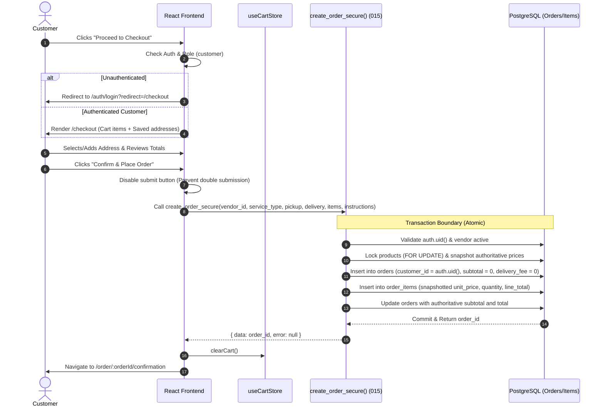

# KINGDOMDASH — PHASE 6 TECHNICAL DESIGN
## Customer Ordering & Cart Architecture

**Document Version:** 1.1.0  
**Status:** READY FOR IMPLEMENTATION REVIEW  
**Platform:** KingdomDash (Launch Market: Ijebu-Ode, Ogun State)  
**Tagline:** SWIFT IN MOTION.  
**Author:** Antigravity  

---

## 1. Architectural Assessment & Phase 5 Integration Points

### 1.1 Existing System Assessment
KingdomDash has completed Phases 0 through 5:
- **Phase 3 Auth & RBAC:** Session management, role resolution (`get_current_user_role()`), and RouteGuard protecting authenticated routes (`/dashboard`, `/vendor`, `/rider`, `/admin`).
- **Phase 4 Public Website:** Public discovery pages (`/food`, `/groceries`, `/courier`, etc.) with responsive navigation and design system tokens.
- **Phase 5 Vendor & Product System:** Catalog database schema (`vendors`, `categories`, `products`), vendor dashboard management, and Migration `016` ownership hardening.

### 1.2 Phase 5 Integration Points
- **Product Card (`src/components/shared/product-card.tsx`):** Contains a plus (`+`) button currently showing a toast placeholder. This will be connected to `useCartStore.addItem()`.
- **Food Detail (`src/pages/public/food-detail.tsx`) & Grocery Detail (`src/pages/public/grocery-detail.tsx`):** Deliver the live vendor context (`vendor.id`, `vendor.business_name`, `vendor.business_address`, `vendor.business_type`) required to instantiate cart items with vendor linkage.
- **Navbar (`src/components/layout/navbar.tsx`):** Will feature an interactive Cart Trigger button with a badge showing total cart items, triggering the Cart Drawer.

---

## 2. Cart Architecture & State Management

### 2.1 State Store Design (`useCartStore`)
The cart state will be implemented as a Zustand store with `persist` middleware to ensure continuity across page reloads and browser sessions.

```typescript
// Proposed Store Structure: src/stores/cart-store.ts

export interface CartItem {
  productId: string
  vendorId: string
  serviceType: 'food' | 'grocery'
  name: string
  price: number // Display only — authoritative price determined by DB
  quantity: number
  imageUrl: string | null
}

export interface CartVendor {
  id: string
  name: string
  address: string
  serviceType: 'food' | 'grocery'
}

export interface CartState {
  items: CartItem[]
  vendor: CartVendor | null
  isOpen: boolean // Cart drawer toggle
  
  // Actions
  addItem: (item: Omit<CartItem, 'quantity'>, vendor: CartVendor) => { conflict: boolean; currentVendorName?: string }
  updateQuantity: (productId: string, quantity: number) => void
  removeItem: (productId: string) => void
  clearCart: () => void
  setCartOpen: (open: boolean) => void
  
  // Computed getters
  getItemCount: () => number
  getSubtotal: () => number
}
```

### 2.2 Persistence Strategy
- Storage mechanism: `localStorage` under key `kingdomdash_cart_v1`.
- Serialized data: `items`, `vendor`.
- Runtime validation: On hydration, cart items are validated against the schema; if invalid or corrupted, the state gracefully falls back to `{ items: [], vendor: null }`.
- Ephemeral state: `isOpen` is not persisted across reloads.

### 2.3 Vendor Consistency Model
- Single-vendor constraint: A cart represents an order fulfilled by one restaurant or grocery store.
- When `addItem` is called:
  1. If `cart.vendor === null`, set `cart.vendor = newVendor` and add item.
  2. If `cart.vendor.id === newVendor.id`, append or increment item.
  3. If `cart.vendor.id !== newVendor.id`, return `{ conflict: true, currentVendorName: cart.vendor.name }`.
- UI Handling: The caller component triggers `<VendorConflictModal />`, presenting:
  - "Start New Cart": Calls `clearCart()` then `addItem()`.
  - "Keep Existing Cart": Dismisses dialog without modifying the cart.

---

## 3. Customer Address Architecture

### 3.1 Database Schema & RLS Alignment
Table: `public.addresses` (created in Migration `20260902000004_create_orders.sql`, indexed in `20260902000013_security_corrections.sql`)
- `id` (uuid, PK)
- `profile_id` (uuid, FK to profiles.id)
- `label` (text, e.g. 'Home', 'Work')
- `recipient_name` (text)
- `phone` (text)
- `address_line_1` (text)
- `address_line_2` (text, nullable)
- `city` (text, default 'Ijebu-Ode')
- `state` (text, default 'Ogun State')
- `postal_code` (text, nullable)
- `is_default` (boolean)

Existing RLS Policy (Migration `20260902000011_create_rls_policies.sql`):
```sql
CREATE POLICY "addresses_all_own" ON public.addresses
  FOR ALL USING (profile_id = auth.uid())
  WITH CHECK (profile_id = auth.uid());
```
This guarantees that:
- Customer A can only query, insert, update, or delete their own addresses.
- Customer B cannot read or alter Customer A's addresses under any circumstances.

### 3.2 Default Address Handling
Because the database does not maintain a trigger to automatically reset previous defaults, the application service layer handles default synchronization explicitly:
- When an address is created or updated with `is_default = true`, existing addresses with `is_default = true` for `auth.uid()` are reset to `false`.
- Address queries sort by `is_default DESC, created_at DESC` so the active default is deterministically prioritized.

### 3.3 Service Layer (`src/services/supabase/addresses.ts`)
```typescript
export interface CustomerAddress {
  id: string
  profile_id: string
  label: string
  recipient_name: string
  phone: string
  address_line_1: string
  address_line_2: string | null
  city: string
  state: string
  postal_code: string | null
  is_default: boolean
  created_at: string
  updated_at: string
}

export type CreateAddressInput = Omit<CustomerAddress, 'id' | 'profile_id' | 'created_at' | 'updated_at'>

export async function getCustomerAddresses(): Promise<{ data: CustomerAddress[] | null; error: Error | null }>
export async function createCustomerAddress(input: CreateAddressInput): Promise<{ data: CustomerAddress | null; error: Error | null }>
export async function updateCustomerAddress(id: string, input: Partial<CreateAddressInput>): Promise<{ data: CustomerAddress | null; error: Error | null }>
export async function deleteCustomerAddress(id: string): Promise<{ error: Error | null }>
export async function setDefaultAddress(id: string): Promise<{ error: Error | null }>
```

---

## 4. Checkout & Secure Order Creation Flow

### 4.1 Sequence Diagram


### 4.2 Error Handling & Resilience
| Failure Scenario | Database / RPC Behavior | Frontend UX Response |
| :--- | :--- | :--- |
| **Product deactivated while in cart** | RPC raises exception: `'Product % not found, not available...'` | Displays alert: *"An item in your cart is no longer available. Please update your cart."* |
| **Vendor closes / inactive** | RPC raises exception: `'Vendor not found or is inactive'` | Displays alert: *"This store is currently unavailable. Please try another vendor."* |
| **Tampered item price in network request** | Client price ignored; RPC selects `price` from `public.products` | Order created with authoritative DB price; confirmation displays real price. |
| **Duplicate product in array** | RPC raises exception: `'Duplicate product_id in p_items'` | Frontend cart aggregates quantities by product ID before sending. |
| **Quantity > 999 or < 1** | RPC raises exception: `'Item quantity must be between 1 and 999'` | Frontend UI validates and bounds quantity; shows inline validation. |
| **Network timeout during RPC** | Button state reset; user can retry safely (no partial order created due to DB rollback). | Toast error: *"Network error. Please check your connection and try again."* |

---

## 5. UI/UX Architecture & Component Structure

### 5.1 New Components to Create
```
src/
├── components/
│   ├── cart/
│   │   ├── cart-drawer.tsx          // Slide-over cart preview accessible globally
│   │   ├── cart-item-row.tsx        // Individual item with quantity controls & remove
│   │   ├── cart-summary.tsx         // Subtotal, standard delivery note, checkout CTA
│   │   ├── vendor-conflict-modal.tsx // Modal dialog when adding from a different vendor
│   │   └── empty-cart-view.tsx      // Friendly empty state with catalog CTA
│   ├── checkout/
│   │   ├── address-selector.tsx     // Card list of saved addresses + "Add New" trigger
│   │   ├── address-form-modal.tsx   // Dialog to create or edit a delivery address
│   │   ├── order-review-items.tsx   // Itemized review table
│   │   └── checkout-summary-card.tsx// Price breakdown and "Place Order" button
│   └── shared/
│       └── product-card.tsx         // Update existing card to invoke useCartStore
```

### 5.2 Pages
- **`/cart` (`src/pages/public/cart.tsx`):** Standalone full-page cart view.
- **`/checkout` (`src/pages/customer/checkout.tsx`):** Order review, address selection, instructions, and order placement.
- **`/order/:orderId/confirmation` (`src/pages/customer/order-confirmation.tsx`):** Success screen with receipt details, status badge (`pending`), delivery address, and guidance on upcoming releases.

---

## 6. Testing & Quality Assurance Strategy

### 6.1 Unit Tests
- `src/stores/__tests__/cart-store.test.ts`:
  - Adding items from same vendor increases quantity.
  - Adding items from different vendor returns conflict signal.
  - Decrementing to 0 removes item.
  - Item counts and subtotals calculated correctly.
  - LocalStorage persistence and recovery.
- `src/services/supabase/__tests__/addresses.test.ts`:
  - `getCustomerAddresses`, `createCustomerAddress`, `updateCustomerAddress`, `deleteCustomerAddress`.

### 6.2 Component & Integration Tests
- `src/components/cart/__tests__/cart-drawer.test.tsx`:
  - Renders empty state when no items.
  - Renders item rows with quantities.
  - Handles conflict modal cancel vs confirm.
- `src/pages/customer/__tests__/checkout.test.tsx`:
  - Redirects unauthenticated users.
  - Renders saved addresses.
  - Triggers `createOrderSecure` with correct payload.
  - Navigates to confirmation on success and clears cart.
- `src/pages/customer/__tests__/order-confirmation.test.tsx`:
  - Fetches and displays order details.
  - Renders 404/error state if order not found.

### 6.3 Security Verification
- Direct database tests verify:
  - Unauthorized callers cannot insert into `orders` or `order_items`.
  - Calling `create_order_secure()` with forged prices yields orders priced by database.
  - Customer A cannot select Customer B's addresses.
