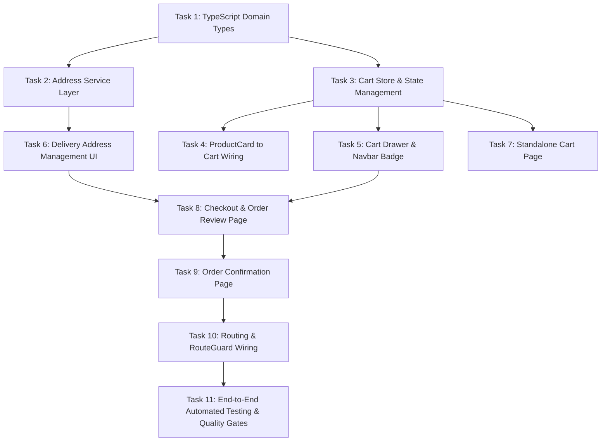

# KINGDOMDASH — PHASE 6 IMPLEMENTATION TASKS
## Customer Ordering & Cart System

**Document Version:** 1.1.0  
**Status:** READY FOR IMPLEMENTATION REVIEW  
**Platform:** KingdomDash (Launch Market: Ijebu-Ode, Ogun State)  
**Tagline:** SWIFT IN MOTION.  
**Author:** Antigravity  

---

## Task Dependency Graph

---

## Task 1: TypeScript Domain Entities & Database Types Extension
- **Objective:** Extend `src/types/database.types.ts` and `src/types/index.ts` to expose first-class types for `addresses`, `orders`, and `order_items` matching existing database schemas.
- **Files Involved:**
  - `src/types/database.types.ts`
  - `src/types/index.ts`
- **Database Changes:** None. Uses existing schema from migrations `20260902000004_create_orders.sql` and `20260902000015_remaining_medium_fixes.sql`.
- **Dependencies:** None.
- **Security Considerations:** Ensure types reflect non-nullable database constraints, status enums, and UUID definitions.
- **Testing Requirements:** TypeScript compilation (`tsc -b`) succeeds with zero errors.
- **Completion Criteria:** `Address`, `Order`, `OrderItem`, and `CreateOrderParams` are exported and cleanly typed.

---

## Task 2: Customer Address Service Layer
- **Objective:** Implement the Supabase service functions for fetching, creating, updating, and deleting customer delivery addresses in `public.addresses`.
- **Files Involved:**
  - `src/services/supabase/addresses.ts` (new)
  - `src/services/supabase/__tests__/addresses.test.ts` (new)
- **Database Changes:** None. Relies on existing `addresses_all_own` RLS policy (`20260902000011_create_rls_policies.sql`).
- **Dependencies:** Task 1.
- **Security Considerations:**
  - All queries leverage active user session via `auth.uid()`.
  - `profile_id` is automatically set to `auth.uid()`.
  - RLS guarantees cross-user isolation.
  - Setting an address as default clears `is_default` on any existing default addresses for `auth.uid()`.
- **Testing Requirements:** Vitest unit tests verifying `getCustomerAddresses`, `createCustomerAddress`, `updateCustomerAddress`, and `deleteCustomerAddress`.
- **Completion Criteria:** Address service successfully performs CRUD operations adhering strictly to RLS policies.

---

## Task 3: Client-Side Cart Store (`useCartStore`)
- **Objective:** Implement Zustand-based cart state store with localStorage persistence, item quantity management, and single-vendor consistency enforcement.
- **Files Involved:**
  - `src/stores/cart-store.ts` (new)
  - `src/stores/__tests__/cart-store.test.ts` (new)
- **Database Changes:** None.
- **Dependencies:** Task 1.
- **Security Considerations:**
  - Cart data is treated as untrusted UI presentation state.
  - Calculations are for display; no client total is authoritative.
  - Enforces quantity bounds (1..999) and max distinct lines (50), mirroring database constraints in `20260902000015_remaining_medium_fixes.sql`.
- **Testing Requirements:** Vitest unit tests verifying:
  - Adding items from the same vendor increments quantity.
  - Adding an item from a different vendor returns conflict signal.
  - Decrementing quantity to 0 removes item.
  - Clear cart resets state.
  - LocalStorage persistence and rehydration.
- **Completion Criteria:** Store handles all cart manipulations, bounds quantities, and detects vendor conflicts.

---

## Task 4: Product-to-Cart Wiring in Catalog Components
- **Objective:** Connect the `+` button in `ProductCard` to `useCartStore.addItem()`, replacing the Phase 4 toast placeholder with actual cart interaction and vendor conflict handling.
- **Files Involved:**
  - `src/components/shared/product-card.tsx`
  - `src/components/cart/vendor-conflict-modal.tsx` (new)
  - `src/pages/public/food-detail.tsx`
  - `src/pages/public/grocery-detail.tsx`
- **Database Changes:** None.
- **Dependencies:** Task 3.
- **Security Considerations:** Only active and available products can be added (`is_available === true`).
- **Testing Requirements:** Component tests verifying clicking `+` adds item to cart and opens drawer or updates badge.
- **Completion Criteria:** Customers browsing `/food/:vendorId` or `/grocery/:storeId` can click `+` on any available dish or product to add it to their cart.

---

## Task 5: Interactive Cart Drawer & Navbar Badge
- **Objective:** Build a responsive slide-over Cart Drawer and integrate a cart trigger with dynamic item counter badge in the global Navbar.
- **Files Involved:**
  - `src/components/cart/cart-drawer.tsx` (new)
  - `src/components/cart/cart-item-row.tsx` (new)
  - `src/components/cart/cart-summary.tsx` (new)
  - `src/components/cart/empty-cart-view.tsx` (new)
  - `src/components/layout/navbar.tsx`
- **Database Changes:** None.
- **Dependencies:** Task 3, Task 4.
- **Security Considerations:** Proper ARIA dialog roles, focus trap, and keyboard dismissal (Escape).
- **Testing Requirements:** Component tests verifying drawer open/close, quantity adjustments, empty state, and checkout link.
- **Completion Criteria:** Cart button appears in Navbar with live item counter; clicking it smoothly opens drawer with itemized summary.

---

## Task 6: Delivery Address Selection & Creation UI
- **Objective:** Build customer address management components for checkout, enabling address selection, default address selection, and adding new addresses.
- **Files Involved:**
  - `src/components/checkout/address-selector.tsx` (new)
  - `src/components/checkout/address-form-modal.tsx` (new)
  - `src/components/checkout/__tests__/address-selector.test.tsx` (new)
- **Database Changes:** None.
- **Dependencies:** Task 2.
- **Security Considerations:** Validate Nigerian phone numbers and require non-empty street addresses.
- **Testing Requirements:** Form validation tests for address fields; address selection callbacks.
- **Completion Criteria:** Customers can choose from saved addresses or add a new address directly from checkout without losing their cart state.

---

## Task 7: Standalone Cart Page (`/cart`)
- **Objective:** Implement full-page cart route providing accessible, responsive cart review for users who prefer full pages over slide-over drawers.
- **Files Involved:**
  - `src/pages/public/cart.tsx` (new)
  - `src/pages/public/__tests__/cart.test.tsx` (new)
- **Database Changes:** None.
- **Dependencies:** Task 3, Task 5.
- **Security Considerations:** Accessible without authentication; redirect to `/auth/login?redirect=/checkout` upon clicking "Proceed to Checkout".
- **Testing Requirements:** Unit and integration tests verifying item rendering, subtotal updates, and empty state.
- **Completion Criteria:** `/cart` route displays all cart items with full controls and responsive layout.

---

## Task 8: Checkout & Order Review Page (`/checkout`)
- **Objective:** Implement protected checkout page that brings together selected items, vendor details, address selection, special instructions, and secure order placement.
- **Files Involved:**
  - `src/pages/customer/checkout.tsx` (new)
  - `src/components/checkout/order-review-items.tsx` (new)
  - `src/components/checkout/checkout-summary-card.tsx` (new)
  - `src/pages/customer/__tests__/checkout.test.tsx` (new)
- **Database Changes:** None. Calls existing `create_order_secure()` RPC (`20260902000015_remaining_medium_fixes.sql`).
- **Dependencies:** Task 2, Task 3, Task 6.
- **Security Considerations:**
  - Protected by `RouteGuard allowedRoles={['customer']}`.
  - Disables submit button during RPC invocation to prevent double submission.
  - Sends only permitted fields (`vendor_id`, `service_type`, `pickup_address`, `delivery_address`, `items`, `special_instructions`).
  - Clearly displays delivery fee notice: *"Delivery fee will be calculated based on distance in Phase 8. For this launch preview, base delivery fee is set to ₦0.00."*
- **Testing Requirements:**
  - Empty cart redirects/shows warning.
  - Address required before placing order.
  - Successful RPC call clears cart and navigates to confirmation.
- **Completion Criteria:** Customer can review order details, provide delivery instructions, and trigger atomic order creation.

---

## Task 9: Order Confirmation Page (`/order/:orderId/confirmation`)
- **Objective:** Create the order confirmation screen displaying the placed order's reference, authoritative totals, delivery address, and status.
- **Files Involved:**
  - `src/pages/customer/order-confirmation.tsx` (new)
  - `src/pages/customer/__tests__/order-confirmation.test.tsx` (new)
- **Database Changes:** None. Reads order via `getOrderById()`.
- **Dependencies:** Task 1, Task 8.
- **Security Considerations:**
  - RLS enforces that only the ordering customer (or admin) can view the order.
  - Does NOT make claims about kitchen preparation, rider dispatch, or payment completion.
  - Confirms order status `pending`, recorded receipt, and notes regarding future phase integrations.
- **Testing Requirements:** Tests verifying receipt rendering, order status badge, and handling non-existent/unauthorized orders.
- **Completion Criteria:** Successfully placed order renders itemized receipt with real database values.

---

## Task 10: Routing & RouteGuard Integration
- **Objective:** Register all Phase 6 routes in `src/App.tsx`, wrapping `/checkout` and `/order/:orderId/confirmation` with `RouteGuard allowedRoles={['customer']}` and adding `/cart` to public routes.
- **Files Involved:**
  - `src/App.tsx`
- **Database Changes:** None.
- **Dependencies:** Task 7, Task 8, Task 9.
- **Security Considerations:** Unauthenticated users attempting to access `/checkout` are safely redirected via `RedirectWithQuery` or RouteGuard to `/auth/login?redirect=/checkout`.
- **Testing Requirements:** App routing tests verifying public vs protected access.
- **Completion Criteria:** All routes load correctly with lazy loading, proper document titles, and RBAC enforcement.

---

## Task 11: End-to-End Automated Testing & Quality Gates
- **Objective:** Run complete automated verification across all test suites, linting, type checks, and production builds to ensure zero regressions.
- **Commands:**
  - `npx tsc -b`
  - `npx oxlint`
  - `npm test`
  - `npm run build`
- **Completion Criteria:** 100% green checks across all gates with zero regressions to Phases 0–5.
