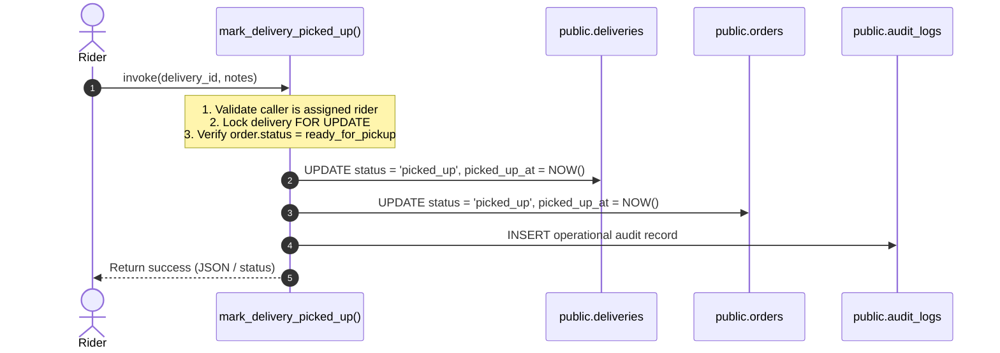
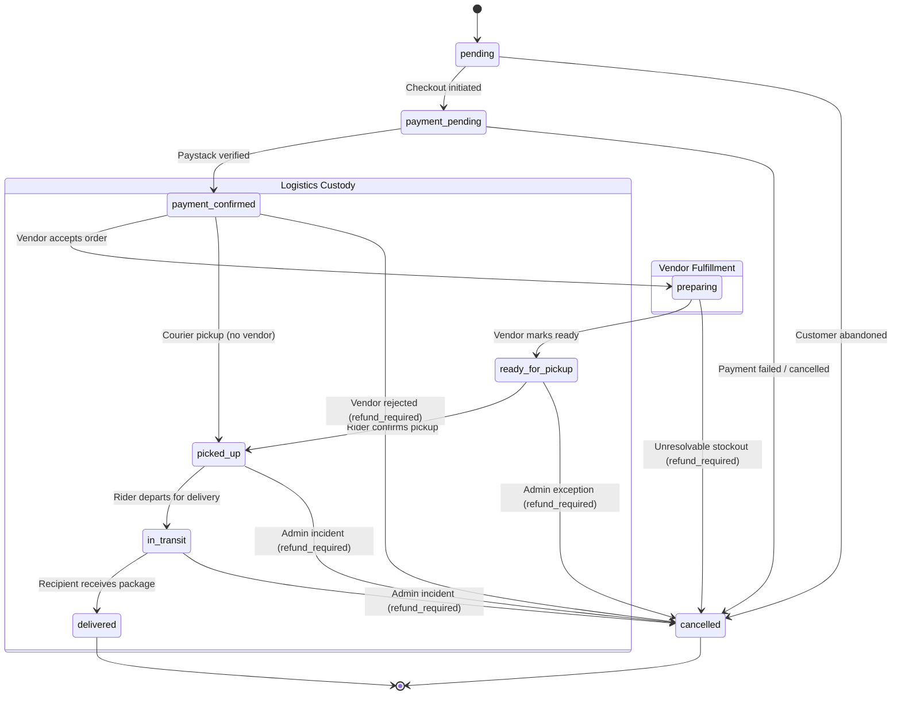
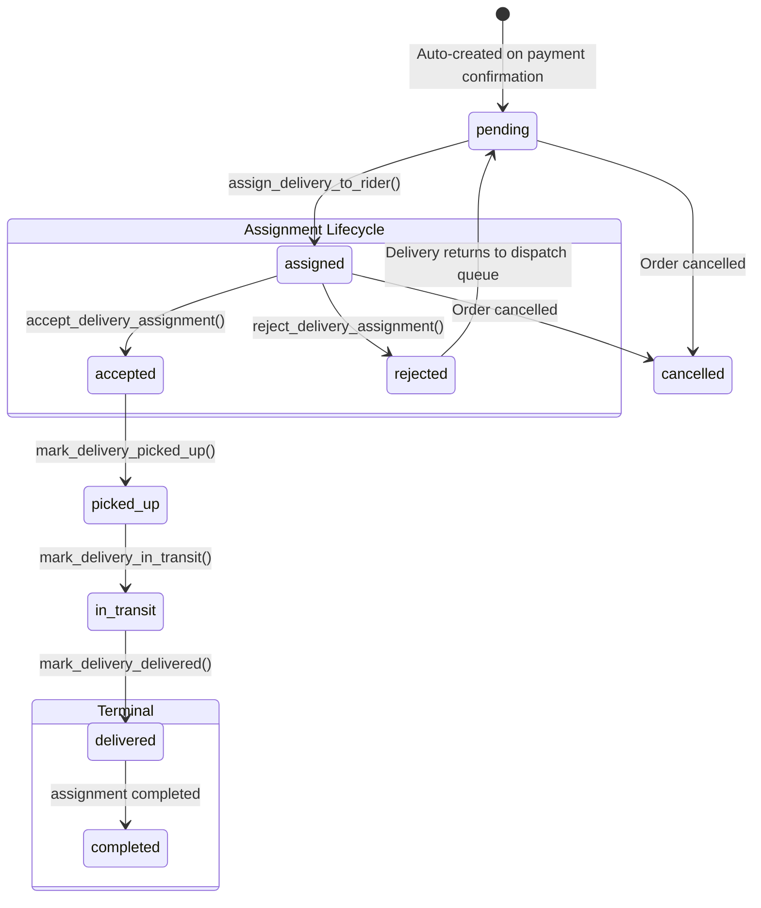
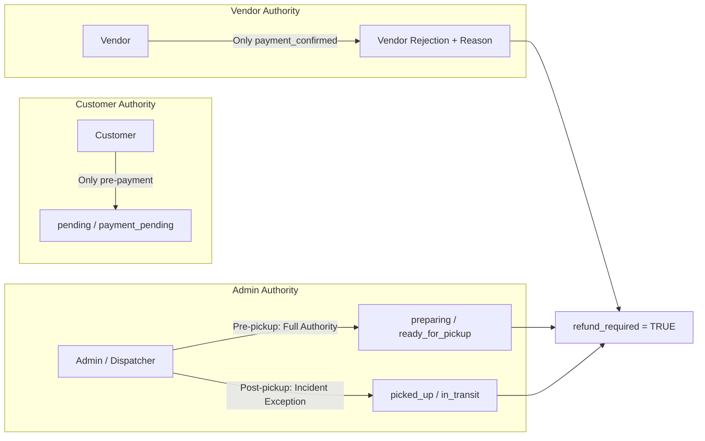

# KINGDOMDASH — PHASE 10: ORDER & DELIVERY OPERATIONS
# TECHNICAL ARCHITECTURE & SYSTEM DESIGN SPECIFICATION

**Document Version:** 2.0.0 (Master Correction Reconciled)  
**Status:** Mandatory Pre-Implementation Specification — Approved for Final Review  
**Execution Mode:** Planning / Architecture Only (Implementation NOT Authorized)  
**Target Release:** KingdomDash Phase 10  
**Scope:** Three-Tier State Machine Engine, Atomic Transition RPCs, Dispatch Contracts & Security Hardening  

---

## 1. System Architecture & State Machine Separation

Phase 10 explicitly establishes **three independent, non-interchangeable state machines** to model the lifecycle of commerce, physical logistics, and actor dispatch:

```
┌─────────────────────────────────────────────────────────────────────────────┐
│ 1. ORDER STATE MACHINE (Commercial / Customer Commitment)                  │
│    pending ──► payment_pending ──► payment_confirmed ──► preparing ──►      │
│    ready_for_pickup ──► picked_up ──► in_transit ──► delivered (or cancelled)│
└─────────────────────────────────────────────────────────────────────────────┘
                                      │ (spawns 1:1 delivery)
                                      ▼
┌─────────────────────────────────────────────────────────────────────────────┐
│ 2. DELIVERY STATE MACHINE (Physical Logistics & Custody)                   │
│    pending ──► assigned ──► picked_up ──► in_transit ──► delivered         │
│         ▲            │                                                      │
│         └──(reject)──┘ (or cancelled via operational exception)             │
└─────────────────────────────────────────────────────────────────────────────┘
                                      │ (dispatched to rider)
                                      ▼
┌─────────────────────────────────────────────────────────────────────────────┐
│ 3. ASSIGNMENT STATE MACHINE (Rider Contract Relationship)                  │
│    assigned ──► accepted ──► completed                                     │
│         │                                                                   │
│         └──► rejected (delivery status reverts to pending)                  │
└─────────────────────────────────────────────────────────────────────────────┘
```

### 1.1 Distinct State Meanings
- **`orders.status`:** The commercial contract between customer, merchant, and KingdomDash. Determines customer billing, vendor prep obligations, and service completion.
- **`deliveries.status`:** The physical transport entity. Determines package location, delivery address snapshot, and physical custody stage.
- **`delivery_assignments.status`:** The contractual offer made to a specific rider. Governs whether a rider has accepted an offer, declined it, or completed delivery.
- **Critical Invariant:** `deliveries.status = 'assigned'` and `delivery_assignments.status = 'accepted'` coexist concurrently. A rider accepting an assignment does **NOT** advance the delivery to `picked_up`.

---

## 2. Removal of Generic Bidirectional Sync Triggers

### 2.1 Why Generic Triggers Are Prohibited
The previously drafted trigger `trg_fn_sync_delivery_to_order()` is **strictly removed** from the Phase 10 architecture. Generic database triggers that mirror status across different tables create:
1. **Hidden side-effects:** Order status changing without validating commercial or vendor preconditions.
2. **Recursive updates & locking deadlocks:** Unpredictable trigger cascades during high-concurrency dispatch.
3. **Impossibility of granular validation:** Failing to distinguish whether a transition was triggered by an authorized rider, an admin override, or an unauthorized direct SQL update.

### 2.2 The Replacement: Atomic Transition RPCs
Every operational step spanning multiple tables must be executed through explicit PostgreSQL `SECURITY DEFINER` RPCs. Each function updates the appropriate order, delivery, and assignment rows in a single atomic transaction:



---

## 3. Detailed State Transition Diagrams

### 3.1 Order Lifecycle


### 3.2 Delivery & Assignment Lifecycle


---

## 4. Operational Transition Rules & SQLSTATE Error Model

PostgreSQL RPCs must never return raw HTTP status codes. Instead, they raise structured exceptions with custom SQLSTATE codes:
- **`KD400`:** Bad Request / Invalid parameters
- **`KD403`:** Forbidden / Caller not authorized for this entity
- **`KD404`:** Not Found / Entity does not exist
- **`KD409`:** Conflict / Precondition failed (e.g. invalid current state)

### 4.1 Transition Rules Table

| Operation | Entity | From State | To State | Caller Authority | Preconditions | SQLSTATE on Failure |
| :--- | :--- | :--- | :--- | :--- | :--- | :--- |
| `reconcile_paystack_payment` | Order | `payment_pending` | `payment_confirmed` | Server / Webhook | Paystack `status = 'success'` | `KD409` |
| `update_order_status_vendor` | Order | `payment_confirmed`| `preparing` | Vendor (`profile_id`) | Service in (`food`, `grocery`), vendor owns order | `KD403`, `KD409` |
| `update_order_status_vendor` | Order | `preparing` | `ready_for_pickup` | Vendor (`profile_id`) | Order in `preparing`, vendor owns order | `KD403`, `KD409` |
| `assign_delivery_to_rider` | Delivery | `pending` | `assigned` | Admin / Dispatcher | Rider is verified, active, available, 0 active tasks | `KD403`, `KD409` |
| `accept_delivery_assignment` | Assignment| `assigned` | `accepted` | Assigned Rider | Assignment belongs to caller, current status `assigned` | `KD403`, `KD409` |
| `reject_delivery_assignment` | Assignment| `assigned` | `rejected` | Assigned Rider | Assignment belongs to caller; delivery reverts to `pending` | `KD403`, `KD409` |
| `mark_delivery_picked_up` | Delivery & Order | `assigned` | `picked_up` | Assigned Rider | Assignment is `accepted`; Order is `ready_for_pickup` (or courier `payment_confirmed`) | `KD403`, `KD409` |
| `mark_delivery_in_transit` | Delivery & Order | `picked_up` | `in_transit` | Assigned Rider | Current status is `picked_up` | `KD403`, `KD409` |
| `mark_delivery_delivered` | Delivery, Order, Assignment | `in_transit` | `delivered` (Assignment `completed`) | Assigned Rider | Current status is `in_transit` | `KD403`, `KD409` |
| `cancel_order_operational` | Order & Delivery | Any pre-delivered | `cancelled` | Role-Gated | Satisfies Cancellation Matrix (Section 7) | `KD403`, `KD409` |

---

## 5. Dispatch Timing & Rider Assignment Engine

### 5.1 Explicit Dispatch Timing Decision
To minimize customer delivery times while preventing premature rider pickups:
1. **Dispatchable Window:** An order becomes eligible for dispatch (`pending` → `assigned`) as soon as `orders.status` enters `'preparing'` (or `'payment_confirmed'` for courier). This allows the assigned rider to travel to the vendor while preparation is underway.
2. **Pickup Block Gate:** `mark_delivery_picked_up()` enforces that for `food` and `grocery` orders, `orders.status` must strictly equal `'ready_for_pickup'`. If a rider attempts pickup before the vendor signals readiness:
   ```sql
   IF v_order.service_type IN ('food', 'grocery') AND v_order.status != 'ready_for_pickup' THEN
       RAISE EXCEPTION 'Cannot pick up order %: vendor preparation not complete (current order status: %)',
           v_order.id, v_order.status
       USING ERRCODE = 'KD409';
   END IF;
   ```

### 5.2 Rider Eligibility Verification
Inside `assign_delivery_to_rider()`, the database executes the following checks against `public.riders`:
```sql
SELECT r.id, r.is_verified, r.is_active, r.is_available
INTO v_rider
FROM public.riders r
WHERE r.id = p_rider_id
FOR SHARE;

IF NOT FOUND OR NOT v_rider.is_verified OR NOT v_rider.is_active OR NOT v_rider.is_available THEN
    RAISE EXCEPTION 'Rider % is not eligible or not available for assignment', p_rider_id
    USING ERRCODE = 'KD409';
END IF;

-- Ensure rider has no existing in-flight delivery
IF EXISTS (
    SELECT 1 FROM public.delivery_assignments da
    JOIN public.deliveries d ON d.id = da.delivery_id
    WHERE da.rider_id = p_rider_id
      AND da.status IN ('assigned', 'accepted')
      AND d.status IN ('assigned', 'picked_up', 'in_transit')
) THEN
    RAISE EXCEPTION 'Rider % already has an active in-flight delivery', p_rider_id
    USING ERRCODE = 'KD409';
END IF;
```

---

## 6. Courier Operational Ingestion Architecture

### 6.1 Resolving the Existing Ingestion Gap
The current `create_order_secure` RPC explicitly rejects courier orders. Phase 10 introduces a dedicated server-authoritative function:
```sql
public.create_courier_order_secure(
    p_pickup_address text,
    p_pickup_contact text,
    p_pickup_phone text,
    p_pickup_lat numeric,
    p_pickup_lon numeric,
    p_delivery_address text,
    p_delivery_contact text,
    p_delivery_phone text,
    p_delivery_lat numeric,
    p_delivery_lon numeric,
    p_special_instructions text DEFAULT NULL
) RETURNS jsonb
```

### 6.2 Courier Execution Rules
1. Validates that pickup and delivery points fall within active service areas.
2. Computes authoritative straight-line distance via `public.calculate_distance_km()` and evaluates pricing via `public.delivery_pricing_rules` for `service_type = 'courier'`.
3. Inserts into `public.orders` with:
   - `service_type = 'courier'`
   - `vendor_id = NULL`
   - `subtotal = 0.00`
   - `delivery_fee = v_computed_fee`
   - `total = v_computed_fee`
   - `status = 'pending'`
4. Returns the order ID for immediate Paystack payment initialization.
5. Upon payment confirmation, automatic delivery creation instantiates the delivery in `pending` state, ready for immediate dispatch and pickup without vendor stages.

---

## 7. Cancellation Authority & Refund Boundary

### 7.1 Cancellation Authority Matrix



### 7.2 The `refund_required` Financial Marker
When an order is cancelled after payment confirmation:
```sql
UPDATE public.orders
SET status = 'cancelled',
    cancelled_at = pg_catalog.now(),
    cancellation_reason = p_reason,
    refund_required = TRUE,
    refund_status = 'pending_manual_review'
WHERE id = p_order_id;
```
- **Explicit Boundary:** Phase 10 does **not** execute automated credit card/bank refunds through Paystack.
- It sets the financial flag `refund_required = TRUE` to queue the transaction for administrative reconciliation in Phase 12/15.
- Customer-facing interfaces display "Order Cancelled — Queued for Refund Review".

---

## 8. Database-Enforced Immutability & Security

### 8.1 Snapshot Immutability
Once a row in `public.deliveries` is created:
1. `customer_name`, `customer_phone`, `pickup_address`, `delivery_address`, `vendor_id`, and `service_type` are permanently frozen.
2. Direct `UPDATE` permissions on `orders` and `deliveries` tables are completely revoked from the `authenticated` role.
3. Mutations can occur **only** via `SECURITY DEFINER` RPCs with `search_path = public, pg_catalog`.

### 8.2 Vendor Tenant Isolation
Vendors can never update or inspect orders of other merchants. Every vendor RPC queries:
```sql
SELECT id INTO v_vendor_id
FROM public.vendors
WHERE profile_id = auth.uid();

IF v_vendor_id IS NULL OR v_vendor_id != v_order.vendor_id THEN
    RAISE EXCEPTION 'Access denied: caller does not own vendor %', v_order.vendor_id
    USING ERRCODE = 'KD403';
END IF;
```

### 8.3 Trusted Audit Metadata
The audit engine captures metadata from verified server context:
```sql
v_ip_address := current_setting('request.headers', true)::json->>'x-forwarded-for';
v_user_agent := current_setting('request.headers', true)::json->>'user-agent';
```
Client payloads can never overwrite `actor_id` (`auth.uid()`), timestamp (`NOW()`), or client IP.

---

## 9. RPC Function Specifications

### 1. `update_order_status_vendor(p_order_id uuid, p_new_status order_status)`
- **Purpose:** Advance order fulfillment (`payment_confirmed → preparing → ready_for_pickup`).
- **Auth:** Authenticated vendor owner.
- **Preconditions:** Sequential state check; rejects courier orders.
- **SQLSTATE:** `KD403` (unauthorized), `KD409` (invalid sequence).

### 2. `assign_delivery_to_rider(p_delivery_id uuid, p_rider_id uuid)`
- **Purpose:** Assign an unassigned delivery to an available rider.
- **Auth:** Administrator / Dispatcher.
- **Concurrency:** `SELECT ... FROM public.deliveries WHERE id = p_delivery_id FOR UPDATE`.
- **Preconditions:** Delivery in `'pending'`; rider verified, active, available, 0 active deliveries.
- **Mutations:** Inserts `delivery_assignments` (`assigned`), updates `deliveries.status = 'assigned'`.

### 3. `accept_delivery_assignment(p_assignment_id uuid)`
- **Purpose:** Rider accepts assigned delivery.
- **Auth:** Authenticated assigned rider (`riders.profile_id = auth.uid()`).
- **Idempotency:** If already `accepted`, returns success without error.
- **Mutations:** `delivery_assignments.status = 'accepted'`, `responded_at = NOW()`. Delivery status remains `assigned`.

### 4. `reject_delivery_assignment(p_assignment_id uuid, p_reason text DEFAULT NULL)`
- **Purpose:** Rider declines assigned delivery.
- **Auth:** Authenticated assigned rider.
- **Preconditions:** Assignment currently `assigned`.
- **Mutations:** `delivery_assignments.status = 'rejected'`, `deliveries.status = 'pending'` (ready for reassignment).

### 5. `mark_delivery_picked_up(p_delivery_id uuid, p_notes text DEFAULT NULL)`
- **Purpose:** Confirm physical package custody transfer.
- **Auth:** Authenticated assigned rider with `accepted` assignment.
- **Preconditions:** Order must be `ready_for_pickup` (food/grocery) or `payment_confirmed` (courier).
- **Mutations:** Atomically sets `deliveries.status = 'picked_up'`, `orders.status = 'picked_up'`, records `picked_up_at = NOW()`.

### 6. `mark_delivery_in_transit(p_delivery_id uuid, p_notes text DEFAULT NULL)`
- **Purpose:** Rider commences delivery travel to customer destination.
- **Auth:** Authenticated assigned rider.
- **Preconditions:** Current status strictly `picked_up`.
- **Mutations:** Atomically sets `deliveries.status = 'in_transit'`, `orders.status = 'in_transit'`, records `in_transit_at = NOW()`.

### 7. `mark_delivery_delivered(p_delivery_id uuid, p_notes text DEFAULT NULL)`
- **Purpose:** Final delivery completion.
- **Auth:** Authenticated assigned rider.
- **Idempotency:** If already `delivered`, returns success without side-effects.
- **Mutations:** Atomically sets `deliveries.status = 'delivered'`, `orders.status = 'delivered'`, `delivery_assignments.status = 'completed'`, records `delivered_at = NOW()`.

### 8. `cancel_order_operational(p_order_id uuid, p_reason text)`
- **Purpose:** Server-authoritative cancellation with role-based validation.
- **Auth:** Customer (pre-payment only), Vendor (pre-prep only), Admin (pre-delivery).
- **Mutations:** Sets `orders.status = 'cancelled'`, `deliveries.status = 'cancelled'`, flags `refund_required = TRUE` if paid, records `cancelled_at = NOW()` and `cancellation_reason`.

---

## 10. Database Schema Enhancements (Migration 020 Planned)

```sql
-- Planned Migration: 20260902000020_order_delivery_operations.sql

-- 1. Operational timestamps & refund markers on orders
ALTER TABLE public.orders
ADD COLUMN IF NOT EXISTS confirmed_at timestamptz,
ADD COLUMN IF NOT EXISTS preparing_at timestamptz,
ADD COLUMN IF NOT EXISTS ready_at timestamptz,
ADD COLUMN IF NOT EXISTS picked_up_at timestamptz,
ADD COLUMN IF NOT EXISTS in_transit_at timestamptz,
ADD COLUMN IF NOT EXISTS delivered_at timestamptz,
ADD COLUMN IF NOT EXISTS cancelled_at timestamptz,
ADD COLUMN IF NOT EXISTS cancellation_reason text,
ADD COLUMN IF NOT EXISTS refund_required boolean DEFAULT false,
ADD COLUMN IF NOT EXISTS refund_status text DEFAULT NULL;

-- 2. Operational timestamps on deliveries
ALTER TABLE public.deliveries
ADD COLUMN IF NOT EXISTS picked_up_at timestamptz,
ADD COLUMN IF NOT EXISTS in_transit_at timestamptz,
ADD COLUMN IF NOT EXISTS delivered_at timestamptz,
ADD COLUMN IF NOT EXISTS cancelled_at timestamptz;

-- 3. Partial Unique Index: Prevent multiple active assignments for the same delivery
CREATE UNIQUE INDEX IF NOT EXISTS idx_active_delivery_assignment
ON public.delivery_assignments (delivery_id)
WHERE status IN ('assigned', 'accepted');

-- 4. Automatic Delivery Creation Trigger on Payment Confirmed
CREATE OR REPLACE FUNCTION public.trg_fn_create_delivery_on_payment_confirmed()
RETURNS trigger
LANGUAGE plpgsql
SECURITY DEFINER
SET search_path = public, pg_catalog
AS $$
BEGIN
    IF NEW.status = 'payment_confirmed' AND (OLD.status IS DISTINCT FROM 'payment_confirmed') THEN
        IF NOT EXISTS (SELECT 1 FROM public.deliveries WHERE order_id = NEW.id) THEN
            INSERT INTO public.deliveries (
                order_id,
                customer_name,
                customer_phone,
                service_type,
                vendor_id,
                pickup_address,
                pickup_contact,
                delivery_address,
                delivery_contact,
                special_instructions,
                status
            ) VALUES (
                NEW.id,
                COALESCE((SELECT full_name FROM public.profiles WHERE id = NEW.customer_id), 'Customer'),
                COALESCE((SELECT phone_number FROM public.profiles WHERE id = NEW.customer_id), 'N/A'),
                NEW.service_type,
                NEW.vendor_id,
                NEW.pickup_address,
                CASE WHEN NEW.vendor_id IS NOT NULL THEN (SELECT name FROM public.vendors WHERE id = NEW.vendor_id) ELSE 'Sender' END,
                NEW.delivery_address,
                COALESCE((SELECT full_name FROM public.profiles WHERE id = NEW.customer_id), 'Customer'),
                NEW.special_instructions,
                'pending'
            );
        END IF;
    END IF;
    RETURN NEW;
END;
$$;
```
