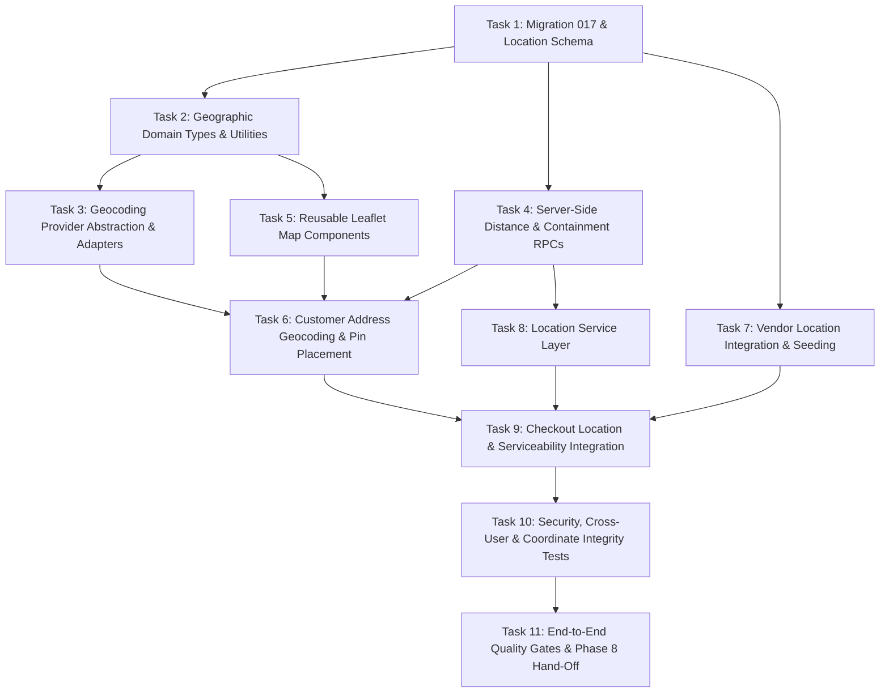

# KINGDOMDASH — PHASE 7: MAPS & LOCATION SERVICES
## Implementation Tasks Specification (Reconciled)

**Document Version:** 1.1.0 (Reconciled)  
**Phase:** 7 (Maps & Location Services)  
**Author:** Antigravity  
**Status:** Reconciled — Ready for Planning Gate Verification  

---

## 1. Task Dependency Graph

---

## 2. Detailed Task Specifications

### Task 1: Migration 017 & Location Schema
* **Objective**: Create `supabase/migrations/20260902000017_maps_location_services.sql` with additive, surgical geographic fields.
* **Files Affected**:
  - `supabase/migrations/20260902000017_maps_location_services.sql` [NEW]
* **Database Scope**:
  - Add `latitude numeric(10, 7)` and `longitude numeric(10, 7)` to `public.addresses` and `public.vendors`.
  - Add `service_area_id uuid REFERENCES public.service_areas(id)` to `addresses` and `vendors`.
  - Coordinate range check constraints: `[-90, 90]` and `[-180, 180]`.
  - Composite B-tree indexes `(latitude, longitude)` on `addresses` and `vendors`.
  - Add `center_lat`, `center_lon`, `radius_km` to `public.service_areas`.
  - Seed initial launch coverage for `Ijebu-Ode Central` as configurable launch seed data.
  - Implement `calculate_distance_km()` as `SECURITY INVOKER`, `IMMUTABLE`, `PARALLEL SAFE`.
  - Implement `is_location_in_service_area()` as `SECURITY INVOKER`, `STABLE`, `PARALLEL SAFE`.
* **Completion Criteria**: Migration applies cleanly and passes constraint validation.

---

### Task 2: Geographic Domain Types & Utilities
* **Objective**: Define strict TypeScript coordinate types, validation helpers, and client-side geodesic estimators.
* **Files Affected**:
  - `src/types/database.types.ts` [MODIFY]
  - `src/types/index.ts` [MODIFY]
  - `src/utils/geo.ts` [NEW]
  - `src/utils/__tests__/geo.test.ts` [NEW]
* **Key Exports**:
  - `Coordinates` object type `{ latitude: number; longitude: number }`.
  - `isValidLatitude()`, `isValidLongitude()`, `isValidCoordinates()`.
  - `formatCoordinates()`, `computeClientHaversineDistanceKm()` (UI preview only).
* **Completion Criteria**: 100% test coverage across boundary conditions, null inputs, and inverted coordinate detection.

---

### Task 3: Geocoding Provider Abstraction & Adapters
* **Objective**: Create an isolated provider architecture for forward and reverse geocoding.
* **Files Affected**:
  - `src/services/geocoding/types.ts` [NEW]
  - `src/services/geocoding/nominatim-adapter.ts` [NEW]
  - `src/services/geocoding/mock-adapter.ts` [NEW]
  - `src/services/geocoding/index.ts` [NEW]
  - `src/services/geocoding/__tests__/geocoding.test.ts` [NEW]
* **Key Capabilities**:
  - `GeocodingProvider` interface.
  - Nominatim adapter with Nigeria bounds (`countrycodes=ng`) and Ijebu-Ode viewbox bias.
  - Mock adapter with verified Ijebu-Ode landmarks.
  - 400ms debouncing, 8s timeout with `AbortSignal`, typed error normalization.
* **Completion Criteria**: Unit tests verify candidate matching, timeout handling, empty results, and fallback.

---

### Task 4: Server-Side Distance & Containment RPCs
* **Objective**: Implement least-privileged PostgreSQL functions in Migration 017.
* **Key Functions**:
  - `calculate_distance_km`: Haversine formula on WGS84 sphere, returning kilometers with 3-decimal precision (1 meter).
  - `is_location_in_service_area`: Checks point against active service area radius/polygon.
* **Security & Grants**:
  - Both functions are `SECURITY INVOKER` with `SET search_path = public`.
  - Grants: `REVOKE EXECUTE ... FROM PUBLIC; GRANT EXECUTE ... TO authenticated, anon;`.
* **Completion Criteria**: SQL tests confirm distance accuracy, zero-distance for identical points, coordinate range exceptions, and containment checks.

---

### Task 5: Reusable Leaflet Map Components
* **Objective**: Build lightweight, responsive, accessible map components for visualization and pin placement.
* **Files Affected**:
  - `src/components/map/location-map.tsx` [NEW]
  - `src/components/map/location-picker-map.tsx` [NEW]
  - `src/components/map/map-fallback.tsx` [NEW]
  - `src/components/map/__tests__/location-map.test.tsx` [NEW]
* **Capabilities**:
  - Interactive Leaflet map container with OSM tiles.
  - Draggable marker pin with coordinate change callback.
  - Service area circular boundary overlay.
  - Accessible textual coordinate breakdown and keyboard zoom/pan.
  - High-contrast SVG Radar fallback when network tiles are offline.
* **Completion Criteria**: Tests verify marker rendering, coordinate emission on marker move, and fallback view when tiles are unavailable.

---

### Task 6: Customer Address Geocoding & Pin Placement
* **Objective**: Integrate geocoding and interactive pin placement into customer delivery address creation.
* **Files Affected**:
  - `src/components/checkout/address-form-modal.tsx` [MODIFY]
  - `src/services/supabase/addresses.ts` [MODIFY]
  - `src/components/checkout/__tests__/address-selector.test.tsx` [MODIFY]
* **User Flow**:
  1. Customer enters street address.
  2. Debounced autocomplete shows matching candidates in Ijebu-Ode.
  3. Selecting a candidate displays the map with a pinned marker.
  4. Customer can fine-tune pin location by dragging or clicking on the map.
  5. Form submits address with validated `latitude` and `longitude`.
* **Completion Criteria**: Address creation successfully transmits validated coordinates; tests verify customer coordinates cannot affect another user.

---

### Task 7: Vendor Location Integration & Seeding
* **Objective**: Connect vendor locations to real Ijebu-Ode coordinates and display vendor pickup pins.
* **Files Affected**:
  - `src/services/supabase/vendors.ts` [MODIFY]
  - `src/types/database.types.ts` [MODIFY]
  - `supabase/migrations/20260902000017_maps_location_services.sql` [MODIFY]
* **Seeded Vendor Coordinates (Configurable Launch Defaults)**:
  - *Mama Shade Kitchen*: (6.824100, 3.921400) [Degun, Ijebu-Ode]
  - *Ijebu Fresh Mart*: (6.819200, 3.916800) [Awujale, Ijebu-Ode]
* **Completion Criteria**: Vendor objects include coordinates; public food/grocery detail pages reflect verified vendor location coordinates.

---

### Task 8: Location Service Layer
* **Objective**: Build frontend service bindings for the server-side RPCs.
* **Files Affected**:
  - `src/services/supabase/locations.ts` [NEW]
  - `src/services/supabase/__tests__/locations.test.ts` [NEW]
* **Key Methods**:
  - `getAuthoritativeDistanceKm(pickup: Coordinates, delivery: Coordinates)`: invokes `calculate_distance_km`.
  - `checkServiceAreaEligibility(coords: Coordinates)`: invokes `is_location_in_service_area`.
  - `getActiveServiceAreas()`: queries active service areas.
* **Completion Criteria**: Complete test coverage for valid invocation, RPC error handling, and argument mapping.

---

### Task 9: Checkout Location & Serviceability Integration
* **Objective**: Connect selected delivery address coordinates to checkout review and service area check.
* **Files Affected**:
  - `src/pages/customer/checkout.tsx` [MODIFY]
  - `src/components/checkout/checkout-summary-card.tsx` [MODIFY]
  - `src/pages/customer/__tests__/checkout.test.tsx` [MODIFY]
* **Behavior**:
  - When customer selects an address, verifies coordinates are serviceable.
  - If out of service area, displays clear warning and disables "Place Order".
  - If in service area, shows "Verified Delivery Location (Ijebu-Ode Coverage)".
  - Displays distance preview with explicit notice: *"Estimated straight-line distance: X.X km. Delivery fee is ₦0.00 (Launch Preview)."*
* **Completion Criteria**: Checkout blocks unserviceable addresses; cart remains intact; Phase 6 order creation invariants remain completely untouched.

---

### Task 10: Security, Cross-User & Coordinate Integrity Tests
* **Objective**: Implement comprehensive security and boundary tests.
* **Files Affected**:
  - `src/services/supabase/__tests__/maps-security.test.ts` [NEW]
* **Security Checks**:
  - Cross-user address coordinate manipulation blocked by RLS.
  - Forged / out-of-bounds coordinates rejected by DB constraints.
  - Swapped coordinates `(lon, lat)` detection.
  - Client-side distance cannot override server authority.
  - Service area bypass attempts rejected.
* **Completion Criteria**: All security tests pass with 0 failures.

---

### Task 11: End-to-End Quality Gates & Phase 8 Hand-Off
* **Objective**: Execute all project-wide verification gates.
* **Commands**:
  - `npx tsc -b` (0 errors)
  - `npx oxlint` (0 errors)
  - `npm test` (all test files pass)
  - `npm run build` (production build succeeds)
* **Completion Criteria**: Complete verification report produced with all requirements satisfied and Phase 8 hand-off contract ready.
