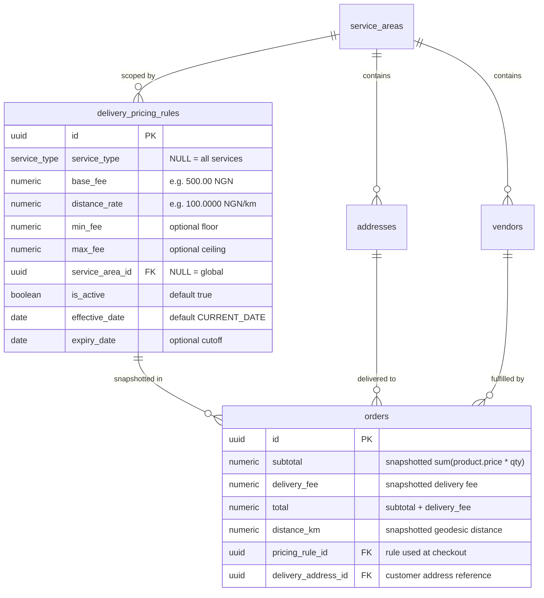

# KINGDOMDASH — PHASE 8: DISTANCE-BASED DELIVERY PRICING
# TECHNICAL DESIGN SPECIFICATION

**Document Version:** 1.0.0  
**Status:** Planning Draft — Awaiting Implementation Authorization  
**Target Release:** KingdomDash Phase 8  
**Scope:** Authoritative Distance-Based Delivery Pricing Engine  

---

## 1. Architecture Reconciliation & Current State

### 1.1 Existing Assets & Completed Capabilities
The current KingdomDash architecture (Phases 0–7) provides the following foundation:

1. **`public.service_areas`** (Migrations 006, 017):
   - Stores `name`, `description`, `coverage_polygon` (GeoJSON), `center_lat`, `center_lon`, `radius_km`, and `is_active`.
   - Seeded with `Ijebu-Ode Central` (6.820556, 3.920833, 12.50 km).
   - Public read policy `service_areas_select_active_public`; admin write policy `service_areas_all_admin`.
2. **`public.addresses`** (Migrations 004, 017):
   - Stores customer addresses linked to `profile_id` via foreign key.
   - Contains `latitude numeric(10,7)`, `longitude numeric(10,7)`, and `service_area_id uuid`.
   - Protected by `addresses_all_own` (`profile_id = auth.uid()`).
3. **`public.vendors`** (Migrations 003, 017):
   - Stores vendor store details, `latitude numeric(10,7)`, `longitude numeric(10,7)`, and `service_area_id uuid`.
   - Protected by `vendors_update_own` and `protect_vendor_immutable_fields()` trigger.
4. **`public.delivery_pricing_rules`** (Migrations 006, 012, 014):
   - Stores `service_type`, `base_fee`, `distance_rate`, `min_fee`, `max_fee`, `service_area_id`, `is_active`, `effective_date`, `expiry_date`.
   - Seeded in Migration 012 with a global fallback rule (`base_fee = 500.00`, `distance_rate = 100.0000`, `service_type = NULL`).
   - Protected by 4 partial unique indexes (Migration 014) ensuring at most one active rule per tier.
   - Public read policy `delivery_pricing_rules_select_active_public`; admin write policy `delivery_pricing_rules_all_admin`.
5. **Authoritative Distance & Serviceability Functions** (Migration 017):
   - `public.calculate_distance_km(lat1, lon1, lat2, lon2)`: Geodesic straight-line distance on WGS84 sphere ($R = 6,371.009\text{ km}$), returning meter-precision kilometers (`numeric(10, 3)`). `IMMUTABLE`, `STRICT`, `PARALLEL SAFE`, `SECURITY INVOKER`.
   - `public.is_location_in_service_area(p_lat, p_lon, p_service_area_id)`: Checks whether a point falls within an active service area. `STABLE`, `PARALLEL SAFE`, `SECURITY INVOKER`.
6. **`public.create_order_secure()`** (Migrations 010, 015):
   - `SECURITY DEFINER` atomic transaction engine.
   - Currently sets `delivery_fee = 0` (Launch Preview) and `total = subtotal`.

---

## 2. Phase 8 Architecture Gaps & Required Enhancements

To transition from the ₦0.00 launch preview to authoritative distance pricing, four architectural enhancements are required:

| Component | Current State (Phase 7) | Required Phase 8 State |
| :--- | :--- | :--- |
| **`orders` Table** | Stores `delivery_fee`, `subtotal`, `total`. No distance or rule snapshot. | Add `distance_km numeric(10, 3)`, `pricing_rule_id uuid`, and `delivery_address_id uuid` for historical financial immutability. |
| **`create_order_secure` RPC** | Takes raw `p_delivery_address text`. Sets `delivery_fee = 0`. | Takes `p_delivery_address_id uuid`. Validates coordinates, service area, selects rule, computes fee, and sets `total = subtotal + delivery_fee`. |
| **Rule Selection Logic** | No formal function or query; raw table exists. | Implement deterministic 4-tier selection algorithm with date filtering and tie-breaking. |
| **Client Preview RPC** | None (client calculates client-side Haversine estimate). | Implement `public.calculate_delivery_fee_preview()` RPC returning authoritative breakdown for UI display. |

---

## 3. Pricing Data Model & Deterministic Selection

### 3.1 Data Model


### 3.2 Deterministic 4-Tier Selection Algorithm
When pricing an order with `p_service_type` and delivery address in `v_service_area_id`:

```sql
SELECT id, base_fee, distance_rate, min_fee, max_fee
FROM public.delivery_pricing_rules
WHERE is_active = true
  AND (service_type IS NULL OR service_type = p_service_type)
  AND (service_area_id IS NULL OR service_area_id = v_service_area_id)
  AND effective_date <= CURRENT_DATE
  AND (expiry_date IS NULL OR expiry_date >= CURRENT_DATE)
ORDER BY
  -- Specificity Tier Evaluation
  (CASE
     WHEN service_type IS NOT NULL AND service_area_id IS NOT NULL THEN 1 -- Tier 1: Service + Area
     WHEN service_type IS NOT NULL AND service_area_id IS NULL     THEN 2 -- Tier 2: Service Global
     WHEN service_type IS NULL     AND service_area_id IS NOT NULL THEN 3 -- Tier 3: Area Universal
     ELSE 4                                                               -- Tier 4: Global Default
   END) ASC,
  effective_date DESC,
  created_at DESC
LIMIT 1;
```

#### Why Determinism is Mathematically Guaranteed:
Migration 014's partial unique indexes enforce:
1. At most one active rule for `(service_type, service_area_id)` (Tier 1)
2. At most one active rule for `(service_type)` with area `NULL` (Tier 2)
3. At most one active rule for `(service_area_id)` with service type `NULL` (Tier 3)
4. At most one active rule with both `NULL` (Tier 4)

Because each tier contains at most one candidate, the `ORDER BY (tier) ASC` guarantees that the most specific rule is selected unambiguously. The secondary `effective_date DESC, created_at DESC` ensures clean tie-breaking in any rare transitional update scenarios.

---

## 4. End-to-End Distance & Pricing Flow

```text
[Customer initiates Checkout]
              ↓
[Customer selects saved Address (p_delivery_address_id)]
              ↓
[Client queries calculate_delivery_fee_preview RPC]
              ↓
[Display estimated fee: Subtotal + Delivery Fee = Estimated Total]
              ↓
[Customer clicks "Place Order"]
              ↓
[Atomic Transaction: public.create_order_secure()]
   ├── 1. Authenticate user: v_user_id := auth.uid()
   ├── 2. Lock & load customer address: SELECT lat, lon, service_area_id FROM addresses WHERE id = p_address_id AND profile_id = v_user_id
   │        └── If coords NULL: ABORT ('Address missing coordinates')
   ├── 3. Validate service area: is_location_in_service_area(address.lat, address.lon, address.service_area_id)
   │        └── If false: ABORT ('Delivery address is outside active service area')
   ├── 4. Lock & load vendor: SELECT lat, lon, is_active FROM vendors WHERE id = p_vendor_id
   │        └── If inactive or coords NULL: ABORT ('Vendor inactive or missing coordinates')
   ├── 5. Calculate geodesic distance: v_distance_km := calculate_distance_km(vendor.lat, vendor.lon, address.lat, address.lon)
   ├── 6. Select pricing rule: 4-Tier deterministic lookup
   │        └── If no rule found: ABORT ('No active pricing rule found')
   ├── 7. Calculate authoritative delivery fee:
   │        v_raw_fee := rule.base_fee + (v_distance_km * rule.distance_rate)
   │        v_fee := round(v_raw_fee, 2)
   │        v_fee := clamp(v_fee, rule.min_fee, rule.max_fee)
   ├── 8. Lock products (FOR UPDATE) & calculate authoritative subtotal
   ├── 9. Calculate authoritative total: v_total := v_subtotal + v_fee
   ├── 10. INSERT orders (customer_id, vendor_id, subtotal, delivery_fee, total, distance_km, pricing_rule_id, delivery_address_id...)
   ├── 11. INSERT order_items (order_id, product_id, product_name, unit_price, quantity, line_total)
   └── 12. COMMIT & Return v_order_id
```

---

## 5. Financial Security & Threat Model

| Attack Vector | Threat Scenario | Defense & Enforcement Mechanism | Outcome |
| :--- | :--- | :--- | :--- |
| **Forged Distance** | Client sends `distance = 0` to reduce fee. | `create_order_secure()` does NOT accept distance as a parameter. Distance is computed solely inside PostgreSQL from DB coordinates. | **Attacker payload ignored.** Fee calculated from real coordinates. |
| **Forged Delivery Fee** | Client sends `delivery_fee = 1.00`. | `create_order_secure()` does NOT accept delivery fee as a parameter. Fee is computed via database pricing formula. | **Attacker payload ignored.** Correct fee enforced. |
| **Forged Order Total** | Client sends `total = 100.00`. | Total is computed as `subtotal + delivery_fee` inside the database transaction. | **Attacker payload ignored.** Correct total enforced. |
| **Forged Product Price** | Client sends `unit_price = 10.00` for an item priced at ₦2,500. | `unit_price` is read directly from `public.products` under `FOR UPDATE` lock. Client-submitted prices are ignored. | **Attacker payload ignored.** Real product price enforced. |
| **Cross-User Address Exploit** | Attacker specifies another customer's `p_delivery_address_id`. | Query filters `WHERE id = p_delivery_address_id AND profile_id = auth.uid()`. | **Transaction aborted.** Exception: Address not found. |
| **Address Coordinate Manipulation** | Customer edits address coordinates right before checkout to appear closer to vendor. | If altered point is outside the service area, order is rejected. If point is near vendor, rider dispatch will deliver to the fake pin (customer will not receive order at their real location). | **Service-area validated.** Self-defeating attack. |
| **Service Type Switching** | Customer sets `p_service_type = 'grocery'` on a restaurant order hoping for a cheaper rate. | Trigger `validate_order_vendor_constraint()` checks vendor business type matches order service type. Product validation verifies products belong to vendor. | **Transaction aborted.** Exception: Vendor type mismatch. |
| **Pricing Rule Tampering** | Attacker attempts to modify `delivery_pricing_rules` table directly via Supabase API. | RLS policy `delivery_pricing_rules_all_admin` restricts INSERT/UPDATE/DELETE strictly to `admin` and `super_admin`. | **Denied (HTTP 403 / 0 rows affected).** |

---

## 6. Function & RPC Specifications

### 6.1 Function 1: `public.calculate_delivery_fee_preview`
- **Purpose**: Fast, read-only delivery fee calculation for frontend UI and cart previews.
- **Security**: `SECURITY INVOKER`, `STABLE`, `SET search_path = public`.
- **Grants**: `REVOKE FROM PUBLIC; GRANT TO authenticated, anon;`
- **Signature**:
  ```sql
  CREATE OR REPLACE FUNCTION public.calculate_delivery_fee_preview(
    p_vendor_id            uuid,
    p_delivery_address_id  uuid,
    p_service_type         service_type
  )
  RETURNS jsonb
  LANGUAGE plpgsql
  STABLE
  SECURITY INVOKER
  SET search_path = public;
  ```
- **Returns JSONB**:
  ```json
  {
    "is_serviceable": true,
    "distance_km": 3.425,
    "base_fee": 500.00,
    "distance_rate": 100.0000,
    "raw_fee": 842.50,
    "delivery_fee": 842.50,
    "pricing_tier": 2,
    "service_area_name": "Ijebu-Ode Central"
  }
  ```

### 6.2 Function 2: `public.create_order_secure` (Extension)
- **Purpose**: Authoritative atomic order creation with integrated distance pricing.
- **Security**: `SECURITY DEFINER`, `VOLATILE`, `SET search_path = public`.
- **Grants**: `REVOKE FROM PUBLIC; GRANT TO authenticated;`
- **Signature**:
  ```sql
  CREATE OR REPLACE FUNCTION public.create_order_secure(
    p_vendor_id            uuid,
    p_service_type         service_type,
    p_pickup_address       text,
    p_delivery_address     text,
    p_items                jsonb,
    p_special_instructions text DEFAULT NULL,
    p_delivery_address_id  uuid DEFAULT NULL
  )
  RETURNS uuid
  LANGUAGE plpgsql
  SECURITY DEFINER
  SET search_path = public;
  ```
- **Backward Compatibility Note**:
  - `p_delivery_address_id` has `DEFAULT NULL`. If `p_delivery_address_id` is provided, the function loads coordinates and calculates authoritative distance pricing.
  - If `p_delivery_address_id IS NULL`, for testing compatibility or fallback, the function raises an exception if Phase 8 requires strict address IDs, or falls back to global default pricing.

---

## 7. Rounding, Currency & Precision Rules

1. **Distance Precision**:
   - Geodesic distance is computed by `calculate_distance_km` in kilometers, rounded to **3 decimal places** (meter precision, e.g. `4.215 km`).
2. **Rate & Computation Precision**:
   - `distance_rate` stored as `numeric(10, 4)` (e.g. `100.0000 NGN/km`).
   - Multiplication: `distance_km * distance_rate` evaluates in exact PostgreSQL arbitrary-precision `numeric`.
3. **Fee Precision & Rounding**:
   - `round(raw_fee, 2)` rounds to **2 decimal places** (kobo precision, e.g. `₦842.50`).
   - Standard round half away from zero.
4. **Order Total**:
   - `total = subtotal + delivery_fee` evaluates in `numeric(12, 2)`.
   - Exact sum, zero floating-point imprecision.

---

## 8. Schema Migration Plan (Migration 018)

Migration `20260902000018_distance_based_delivery_pricing.sql` will perform:
1. **Extend `public.orders`**:
   - `ADD COLUMN IF NOT EXISTS distance_km numeric(10, 3)`
   - `ADD COLUMN IF NOT EXISTS pricing_rule_id uuid REFERENCES public.delivery_pricing_rules(id) ON DELETE SET NULL`
   - `ADD COLUMN IF NOT EXISTS delivery_address_id uuid REFERENCES public.addresses(id) ON DELETE SET NULL`
   - Add foreign key indexes `idx_orders_pricing_rule_id` and `idx_orders_delivery_address_id`.
2. **Create `public.calculate_delivery_fee_preview()` RPC**:
   - Implements 4-tier selection and returns JSON preview.
3. **Update `public.create_order_secure()`**:
   - Integrates address coordinate verification, serviceability check, distance calculation, 4-tier rule selection, fee calculation, and order column snapshotting.
4. **Permissions & Security**:
   - Explicit REVOKE and GRANT statements for both functions.

---

## 9. Frontend Architecture & Checkout Integration

### 9.1 Service Layer (`src/services/supabase/pricing.ts`)
- `getDeliveryFeePreview(vendorId, addressId, serviceType)`:
  Calls `supabase.rpc('calculate_delivery_fee_preview', { ... })`.
- Returns typed `DeliveryFeePreview` object.

### 9.2 Checkout Page (`src/pages/customer/checkout.tsx`)
- When customer selects an address in `AddressSelector`:
  - Triggers `getDeliveryFeePreview(vendor.id, selectedAddress.id, vendor.serviceType)`.
  - Updates summary state with: `deliveryFee`, `distanceKm`, `isServiceable`.
- When placing order:
  - Passes `p_delivery_address_id: selectedAddress.id` into `createOrderSecure()`.

### 9.3 Checkout Summary Card (`src/components/checkout/checkout-summary-card.tsx`)
- Replaces `"₦0.00 (Launch Preview)"` with formatted authoritative preview: e.g. `formatNgn(deliveryFee)`.
- Itemizes the distance breakdown: `Straight-Line Distance: 3.4 km`.
- If address has no coordinates: shows button to "Pin Delivery Location on Map".
- If address is outside service area: disables Place Order button and displays warning alert.
