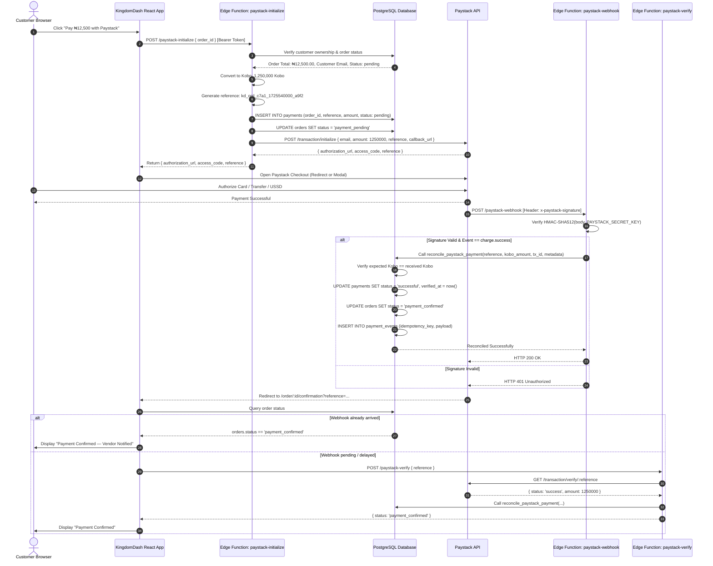
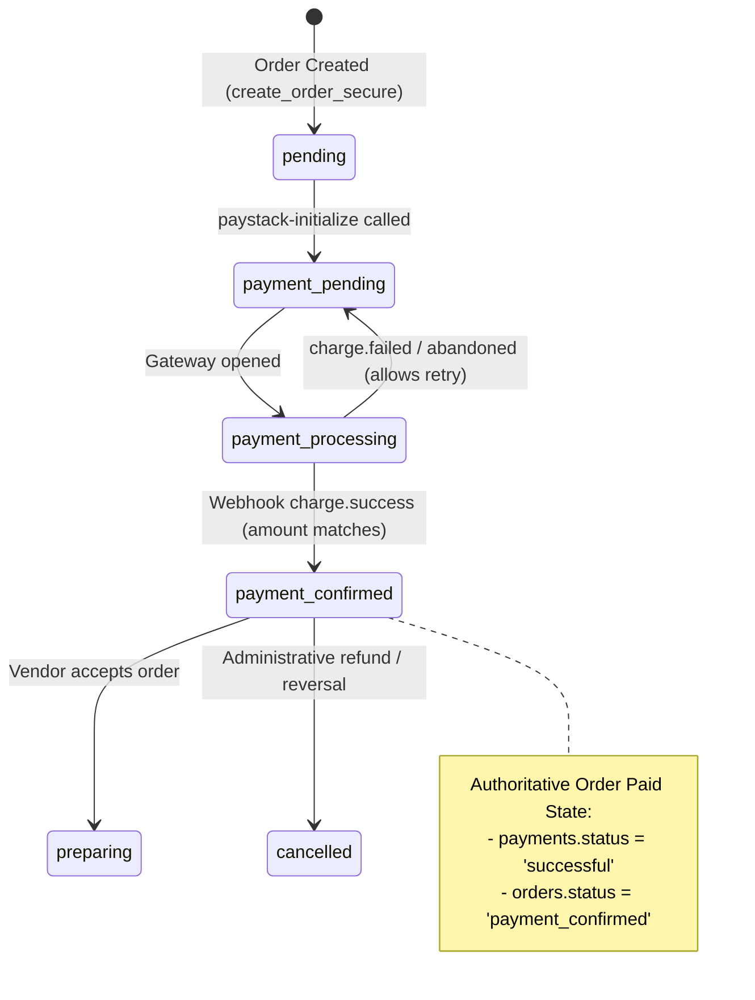

# KINGDOMDASH — PHASE 9: PAYSTACK PAYMENT INTEGRATION
# TECHNICAL ARCHITECTURE & SYSTEM DESIGN SPECIFICATION

**Document Version:** 1.0.0  
**Status:** Planning Architecture Review  
**Target Release:** KingdomDash Phase 9  
**Scope:** Server-Authoritative Paystack Payment Architecture, Security & Lifecycle  

---

## 1. Executive Architecture Summary

KingdomDash Phase 9 establishes the online financial transaction layer for the platform using **Paystack**.

### The Prime Architectural Mandate: Zero Client Financial Authority
```text
┌────────────────────────────────────────────────────────┐
│                        BROWSER                         │
│  Can select payment method. Can click "Pay Now".      │
│  CANNOT set amount. CANNOT mark order as paid.         │
└───────────────────────────┬────────────────────────────┘
                            │ (order_id only)
                            ▼
┌────────────────────────────────────────────────────────┐
│             SUPABASE EDGE FUNCTION BACKEND             │
│  Validates auth & order ownership via JWT.             │
│  Reads authoritative order total from PostgreSQL.      │
│  Calculates Kobo subunits ((total * 100)::bigint).     │
│  Initializes Paystack transaction with secret key.     │
└───────────────┬───────────────────────────┬────────────┘
                │                           │
    (init API)  │                           │ (webhook callback)
                ▼                           ▼
┌────────────────────────┐      ┌────────────────────────┐
│      PAYSTACK API      │      │    DATABASE (PGSQL)    │
│  Processes Card/Bank   │      │  Authoritative Orders, │
│  Transfers/USSD/QR     ├─────►│  Payments & Event Log. │
│  Signs webhooks        │      │  Enforces RLS & immut. │
└────────────────────────┘      └────────────────────────┘
```

---

## 2. Reconciliation of Prior Phases (Phases 6–8)

Before designing Phase 9, all assumptions regarding earlier phases were verified against the live codebase:

| Phase | Established Invariant | Verification in Live Codebase | Status |
| :--- | :--- | :--- | :--- |
| **Phase 6** | Cart is NOT financial authority; `create_order_secure()` recalculates subtotal/total from DB. | Verified in `supabase/migrations/20260902000018_distance_based_delivery_pricing.sql` lines 105–140 (`SELECT price, is_available FROM products WHERE id = ... FOR UPDATE`). | **CONFIRMED** |
| **Phase 6** | Customer owns order and cannot submit client product prices. | Verified in `create_order_secure()` caller validation (`p_customer_id = auth.uid()`). | **CONFIRMED** |
| **Phase 7** | Customer addresses store validated WGS84 coordinates (`latitude`, `longitude`). | Verified in `public.addresses` table (`20260902000017_maps_location_services.sql`). | **CONFIRMED** |
| **Phase 7** | Geographic serviceability enforced server-side. | Verified via `public.is_location_in_service_area()` in migration 017 & 018. | **CONFIRMED** |
| **Phase 8** | Server-authoritative distance calculation. | Verified: `calculate_distance_km()` computes Haversine straight-line distance ($R = 6,371.009\text{ km}$) server-side. | **CONFIRMED** |
| **Phase 8** | Deterministic 4-tier delivery pricing rule selection. | Verified: `select_delivery_pricing_rule()` selects rule by vendor, area, service type, and validity period. | **CONFIRMED** |
| **Phase 8** | Order pricing snapshotted on `orders`. | Verified: `orders` table contains `distance_km`, `pricing_rule_id`, `delivery_address_id`, `delivery_fee`, `subtotal`, and `total`. | **CONFIRMED** |
| **Phase 8** | Orders table does NOT yet have payment settlement flow. | Verified: Orders created with `status = 'pending'`. `payments` table has 1-to-1 unique `order_id` and basic schema. | **REQUIRES PHASE 9** |

---

## 3. End-to-End System Architecture



---

## 4. Backend Service Layer: Supabase Edge Functions

Paystack operations require private API keys and cryptographic operations. Supabase Edge Functions (Deno runtime) provide the isolated serverless execution environment.

### 4.1 Function Breakdown

| Edge Function | Route | Auth Requirement | Primary Responsibilities |
| :--- | :--- | :--- | :--- |
| `paystack-initialize` | `/functions/v1/paystack-initialize` | Authenticated (JWT `auth.uid()`) | 1. Validate caller owns order.<br>2. Re-read authoritative order total.<br>3. Compute Kobo integer.<br>4. Generate unique reference.<br>5. Insert pending `payments` record.<br>6. Call Paystack API `/transaction/initialize`.<br>7. Return `authorization_url` and `access_code`. |
| `paystack-webhook` | `/functions/v1/paystack-webhook` | Public (Validated via `x-paystack-signature`) | 1. Read raw body text.<br>2. Compute HMAC-SHA512 using `PAYSTACK_SECRET_KEY`.<br>3. Timing-safe signature match.<br>4. Reconcile `charge.success` with database RPC.<br>5. Store audit record in `payment_events`.<br>6. Return HTTP 200 to Paystack. |
| `paystack-verify` | `/functions/v1/paystack-verify` | Authenticated (JWT `auth.uid()`) | 1. Fallback endpoint for client callback reconciliation.<br>2. Verify caller owns order linked to reference.<br>3. Call Paystack API `/transaction/verify/:reference`.<br>4. If confirmed, invoke database reconciliation RPC.<br>5. Return verified order status. |

---

## 5. Payment Data Model & Database Schema Changes

### 5.1 Existing `payments` Schema Audit
The existing table from `20260902000005_create_payments.sql`:
```sql
CREATE TABLE public.payments (
  id uuid PRIMARY KEY DEFAULT gen_random_uuid(),
  order_id uuid NOT NULL UNIQUE REFERENCES public.orders(id) ON DELETE RESTRICT,
  paystack_reference text UNIQUE,
  amount numeric(12,2) NOT NULL,
  currency text NOT NULL DEFAULT 'NGN',
  status public.payment_status NOT NULL DEFAULT 'pending',
  verified_at timestamptz,
  created_at timestamptz NOT NULL DEFAULT now(),
  updated_at timestamptz NOT NULL DEFAULT now()
);
```

### 5.2 Architectural Enhancements Required for Phase 9

#### 1. Multiple Payment Attempts per Order
In e-commerce, customers frequently experience card declines, network timeouts, or accidental modal dismissals before completing payment.
- **Problem**: `order_id uuid NOT NULL UNIQUE` prevents creating a new payment attempt record if the first attempt failed or was abandoned.
- **Solution**: Remove the strict global unique constraint on `order_id` and replace it with a partial unique constraint that permits at most **one successful payment** per order:
```sql
ALTER TABLE public.payments DROP CONSTRAINT IF EXISTS payments_order_id_key;

CREATE UNIQUE INDEX idx_payments_one_success_per_order 
ON public.payments(order_id) 
WHERE status = 'successful';
```

#### 2. Enhanced Transaction Metadata Columns
Add audit and tracking fields to `public.payments`:
```sql
ALTER TABLE public.payments
  ADD COLUMN IF NOT EXISTS customer_id uuid REFERENCES public.profiles(id) ON DELETE RESTRICT,
  ADD COLUMN IF NOT EXISTS paystack_transaction_id text,
  ADD COLUMN IF NOT EXISTS channel text,
  ADD COLUMN IF NOT EXISTS gateway_response text,
  ADD COLUMN IF NOT EXISTS paid_at timestamptz;

CREATE INDEX IF NOT EXISTS idx_payments_reference ON public.payments(paystack_reference);
CREATE INDEX IF NOT EXISTS idx_payments_transaction_id ON public.payments(paystack_transaction_id);
```

#### 3. Idempotent Payment Event Log (`public.payment_events`)
A dedicated immutable ledger for all incoming webhook payloads and verification queries:
```sql
CREATE TABLE public.payment_events (
  id uuid PRIMARY KEY DEFAULT gen_random_uuid(),
  payment_id uuid REFERENCES public.payments(id) ON DELETE SET NULL,
  paystack_reference text NOT NULL,
  event_type text NOT NULL,
  idempotency_key text NOT NULL UNIQUE,
  payload jsonb NOT NULL,
  processed_at timestamptz NOT NULL DEFAULT now()
);

CREATE INDEX idx_payment_events_ref ON public.payment_events(paystack_reference);
```

---

## 6. Payment Status Lifecycle & State Machine



### State Mapping Matrix

| Paystack Gateway State | `public.payments.status` | `public.orders.status` | Description & Action |
| :--- | :--- | :--- | :--- |
| Initialized | `pending` | `payment_pending` | Transaction initialized with Paystack API. Reference active. |
| Processing / Pending | `processing` | `payment_processing` | Customer is actively authorizing payment (e.g. USSD, 3DS OTP). |
| Success (`charge.success`) | `successful` | `payment_confirmed` | Amount verified in Kobo. Order becomes payable to vendor. |
| Failed (`charge.failed`) | `failed` | `payment_pending` | Transaction declined. Order remains open for customer to retry. |
| Abandoned (Modal closed) | `failed` | `payment_pending` | Customer closed modal or timeout occurred. Customer can retry. |
| Reversed (`refund.processed`)| `refunded` | `cancelled` | Administrative reversal / cancellation. |

---

## 7. Amount Representation & Subunit Calculation

### 7.1 Nigerian Naira to Kobo Conversion Rule
Paystack operates strictly in currency **subunits**. For Nigerian Naira (`NGN`), 1 Naira = 100 Kobo.

```text
₦12,500.00  ──>  1,250,000 Kobo
₦1,450.50   ──>    145,050 Kobo
```

### 7.2 Strict Server Calculation
To prevent floating-point rounding inaccuracies:
```typescript
// Edge Function Conversion (Deno/TypeScript)
function convertNairaToKobo(nairaAmount: number): number {
  // Round to nearest integer after multiplying by 100
  const kobo = Math.round(nairaAmount * 100);
  if (!Number.isSafeInteger(kobo) || kobo <= 0) {
    throw new Error(`Invalid payment amount: ${nairaAmount}`);
  }
  return kobo;
}
```

```sql
-- PostgreSQL Database Conversion Verification
v_expected_kobo := ROUND(v_order.total * 100)::bigint;

IF p_paystack_kobo_amount <> v_expected_kobo THEN
  RAISE EXCEPTION 'Payment amount mismatch: expected % kobo, received % kobo',
    v_expected_kobo, p_paystack_kobo_amount;
END IF;
```

---

## 8. Webhook Security & Idempotency Architecture

### 8.1 Cryptographic Signature Validation
Paystack signs all webhook payloads with HMAC-SHA512 using the secret key:
```typescript
async function verifyPaystackSignature(
  rawBody: string,
  signatureHeader: string | null,
  secretKey: string
): Promise<boolean> {
  if (!signatureHeader || !secretKey) return false;

  const encoder = new TextEncoder();
  const key = await crypto.subtle.importKey(
    "raw",
    encoder.encode(secretKey),
    { name: "HMAC", hash: "SHA-512" },
    false,
    ["sign", "verify"]
  );

  const calculatedSignatureBytes = await crypto.subtle.sign(
    "HMAC",
    key,
    encoder.encode(rawBody)
  );

  const calculatedSignatureHex = Array.from(new Uint8Array(calculatedSignatureBytes))
    .map((b) => b.toString(16).padStart(2, "0"))
    .join("");

  // Constant-time comparison to prevent timing attacks
  if (calculatedSignatureHex.length !== signatureHeader.length) return false;
  let match = 0;
  for (let i = 0; i < calculatedSignatureHex.length; i++) {
    match |= calculatedSignatureHex.charCodeAt(i) ^ signatureHeader.charCodeAt(i);
  }
  return match === 0;
}
```

### 8.2 Database Webhook Reconciliation RPC (`reconcile_paystack_payment`)
To ensure zero race conditions between duplicate webhooks and client verification:
```sql
CREATE OR REPLACE FUNCTION public.reconcile_paystack_payment(
  p_reference text,
  p_paystack_transaction_id text,
  p_kobo_amount bigint,
  p_currency text,
  p_channel text,
  p_gateway_response text,
  p_paid_at timestamptz,
  p_raw_payload jsonb
)
RETURNS jsonb
LANGUAGE plpgsql
SECURITY DEFINER
SET search_path = public
AS $$
DECLARE
  v_payment public.payments%ROWTYPE;
  v_order public.orders%ROWTYPE;
  v_expected_kobo bigint;
  v_idempotency_key text;
BEGIN
  -- 1. Generate idempotency key
  v_idempotency_key := p_reference || ':charge.success:' || COALESCE(p_paystack_transaction_id, 'none');

  -- 2. Check if already processed
  IF EXISTS (SELECT 1 FROM public.payment_events WHERE idempotency_key = v_idempotency_key) THEN
    RETURN jsonb_build_object('status', 'already_processed', 'reference', p_reference);
  END IF;

  -- 3. Lock payment record FOR UPDATE
  SELECT * INTO v_payment
  FROM public.payments
  WHERE paystack_reference = p_reference
  FOR UPDATE;

  IF NOT FOUND THEN
    RAISE EXCEPTION 'Payment reference % not found', p_reference;
  END IF;

  -- If payment already successful, record event and exit
  IF v_payment.status = 'successful' THEN
    INSERT INTO public.payment_events (payment_id, paystack_reference, event_type, idempotency_key, payload)
    VALUES (v_payment.id, p_reference, 'charge.success.duplicate', v_idempotency_key, p_raw_payload);
    
    RETURN jsonb_build_object('status', 'already_successful', 'order_id', v_payment.order_id);
  END IF;

  -- 4. Lock order record FOR UPDATE
  SELECT * INTO v_order
  FROM public.orders
  WHERE id = v_payment.order_id
  FOR UPDATE;

  -- 5. Currency Check
  IF p_currency <> 'NGN' OR v_order.delivery_fee < 0 THEN
    RAISE EXCEPTION 'Invalid currency % or corrupted order', p_currency;
  END IF;

  -- 6. Amount Check (Subunits)
  v_expected_kobo := ROUND(v_order.total * 100)::bigint;
  IF p_kobo_amount <> v_expected_kobo THEN
    -- Mark payment failed due to amount tampering
    UPDATE public.payments
    SET status = 'failed',
        gateway_response = 'Amount mismatch: expected ' || v_expected_kobo || ' kobo, got ' || p_kobo_amount,
        updated_at = now()
    WHERE id = v_payment.id;

    RAISE EXCEPTION 'Amount mismatch: expected %, received %', v_expected_kobo, p_kobo_amount;
  END IF;

  -- 7. Update Payment Record to Successful
  UPDATE public.payments
  SET status = 'successful',
      paystack_transaction_id = p_paystack_transaction_id,
      channel = p_channel,
      gateway_response = p_gateway_response,
      paid_at = COALESCE(p_paid_at, now()),
      verified_at = now(),
      updated_at = now()
  WHERE id = v_payment.id;

  -- 8. Update Order Status to Payment Confirmed
  UPDATE public.orders
  SET status = 'payment_confirmed',
      updated_at = now()
  WHERE id = v_order.id;

  -- 9. Insert Audit Event Log
  INSERT INTO public.payment_events (
    payment_id, paystack_reference, event_type, idempotency_key, payload
  ) VALUES (
    v_payment.id, p_reference, 'charge.success', v_idempotency_key, p_raw_payload
  );

  RETURN jsonb_build_object(
    'status', 'reconciled',
    'order_id', v_order.id,
    'payment_id', v_payment.id
  );
END;
$$;

-- Secure Permissions: ONLY service_role can call this function
REVOKE ALL ON FUNCTION public.reconcile_paystack_payment FROM PUBLIC;
GRANT EXECUTE ON FUNCTION public.reconcile_paystack_payment TO service_role;
```

---

## 9. Paystack Checkout Mode: Redirect vs. InlineJS

| Consideration | Option A: Standard Hosted Redirect | Option B: Paystack InlineJS Popup |
| :--- | :--- | :--- |
| **How it Works** | Frontend navigates to Paystack's secure hosted page (`authorization_url`). Upon completion, Paystack redirects to `callback_url`. | Frontend loads Paystack JS script and calls `PaystackPop.setup({ access_code })` in an iframe modal. |
| **Mobile Reliability** | **Extremely high**. Operates reliably in all mobile browsers, standalone PWAs, and in-app WebViews (Instagram, WhatsApp). | Medium. Can be blocked by aggressive popup blockers or iOS Safari iframe cookie/storage restrictions. |
| **Security Surface** | Secret key remains 100% backend. Frontend only handles URL navigation. | Secret key remains 100% backend. Requires loading third-party Paystack script on client. |
| **User Experience** | Seamless full-screen checkout with Paystack security branding, automatic bank app switching, and return redirect. | Keeps customer on page in modal overlay. |
| **Network Interruption Recovery** | Redirect includes reference in URL params (`?reference=...`) allowing instant status verification upon return. | If user accidentally dismisses popup or page refreshes during 3DS OTP, state may be lost. |
| **Architectural Verdict** | **Recommended as Primary Strategy**. | Optional progressive enhancement. |

**Phase 9 Architecture Decision**: We implement **Option A (Paystack Hosted Redirect)** as the primary, unshakeable checkout standard. The initialization response returns `{ authorization_url, access_code, reference }`, allowing the frontend to redirect directly via `window.location.href = authorization_url`.

---

## 10. Security & Threat Model (STRIDE Analysis)

| Threat Category | Potential Attack Vector | Mitigation in Phase 9 Architecture |
| :--- | :--- | :--- |
| **Spoofing** | Malicious actor sends fake webhook claiming payment succeeded. | Cryptographic HMAC-SHA512 verification using `PAYSTACK_SECRET_KEY`. Fake signatures rejected with HTTP 401. |
| **Tampering** | Customer modifies HTTP payload to pay ₦100 instead of ₦12,500. | Zero client authority. Amount is looked up from `public.orders.total` on the server. Webhook verifies exact Kobo subunit match. |
| **Repudiation** | Customer claims they paid, but payment never reached KingdomDash. | `public.payment_events` preserves immutable raw gateway payload and timestamp for auditability. |
| **Information Disclosure** | Secret key leaked in frontend bundle or network inspection. | `PAYSTACK_SECRET_KEY` is restricted strictly to Supabase Edge Function secrets. Zero frontend visibility. |
| **Denial of Service** | Flooding webhook endpoint with forged requests. | Lightweight HMAC validation rejects invalid requests before executing any database queries or allocations. |
| **Elevation of Privilege** | Customer calls `reconcile_paystack_payment()` directly to confirm their own order. | Function revoked from `PUBLIC` and `authenticated`; granted strictly to `service_role`. |

---

## 11. Database Migration Strategy

The changes will be encapsulated in a single, atomic, backward-compatible migration:
`supabase/migrations/20260902000019_paystack_payment_integration.sql`

1. **Alter `public.payments`**:
   - Drop global unique constraint on `order_id`.
   - Add partial unique constraint `idx_payments_one_success_per_order`.
   - Add metadata columns: `customer_id`, `paystack_transaction_id`, `channel`, `gateway_response`, `paid_at`.
2. **Create `public.payment_events`**:
   - Audit table for webhook idempotency and event logging.
   - RLS enabled: Accessible only by `service_role` and platform administrators.
3. **Trigger & Immutability Hardening**:
   - Reaffirm `protect_payment_immutable_fields()` trigger preventing edits to `order_id`, `amount`, `currency`.
4. **Stored Procedure**:
   - `public.reconcile_paystack_payment()` with `SECURITY DEFINER`, `search_path = public`, granted exclusively to `service_role`.

---

## 12. Frontend Integration Strategy

### 12.1 Checkout Page (`src/pages/customer/checkout.tsx`)
- Update `PaymentMethodsCard` to indicate active Paystack integration:
  - Label: *"Debit/Credit Card, Bank Transfer, USSD"*
  - Badge: *"Powered by Paystack"*
- Update "Place Order" button in `CheckoutSummaryCard`:
  - When payment method is `paystack`, label reads: `Pay ₦XX,XXX with Paystack`.
  - On click:
    1. Calls `createOrderSecure()` to create the authoritative order (`status: pending`).
    2. Clears customer cart.
    3. Calls Edge Function `paystack-initialize` with `{ order_id }`.
    4. Redirects customer to returned `authorization_url`.

### 12.2 Order Confirmation Page (`src/pages/customer/order-confirmation.tsx`)
- Inspects URL query params for `?reference=...`.
- If order is `payment_confirmed`:
  - Displays green status: *"Payment Successful & Confirmed"*.
  - Displays transaction reference and payment channel.
- If order is `payment_pending` or `payment_processing`:
  - Triggers `paystack-verify` fallback check.
  - Displays amber status: *"Verifying Payment..."* with spinner.
- If payment failed:
  - Displays red banner: *"Payment Incomplete or Declined"*.
  - Provides "Try Again" button navigating back to checkout.

---

## 13. Testing & Quality Assurance Strategy

1. **Unit Tests**:
   - Kobo subunit conversion logic (zero rounding errors, integer safety).
   - Reference generation format and uniqueness.
   - Timing-safe HMAC signature comparison utility.
2. **Integration Tests**:
   - Edge Function `paystack-initialize` mocks Paystack API and verifies order ownership check.
   - Edge Function `paystack-webhook` tests valid signature, invalid signature, duplicate event, and underpayment rejection.
3. **Database Security & RLS Tests**:
   - Verifying customer cannot insert or update `public.payments` directly.
   - Verifying customer can only select their own payments.
   - Verifying `reconcile_paystack_payment` fails when called by non-service-role.
4. **Paystack Test Mode Verification**:
   - Using Paystack test card (`4084 0840 0000 0408`) and simulated bank transfer.
   - Verifying real webhook delivery to local Supabase Edge runtime or staging webhook endpoint.

---

## 14. Rollback & Disaster Recovery Plan

If issues arise during rollout:
- The database schema additions (`columns` on `payments`, `payment_events` table) are purely additive and backward-compatible.
- `PaymentMethodsCard` can quickly toggle Paystack back to preview mode if gateway downtime occurs.
- Order records preserve all Phase 8 delivery-pricing fields independently of payment gateway status.
